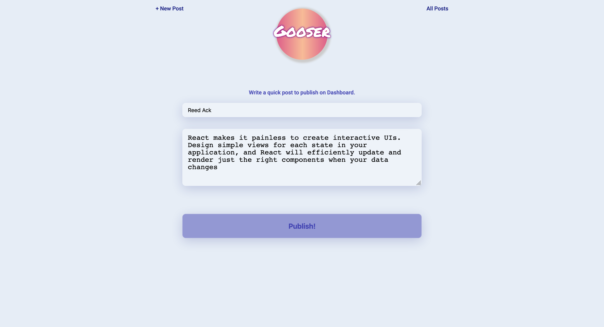
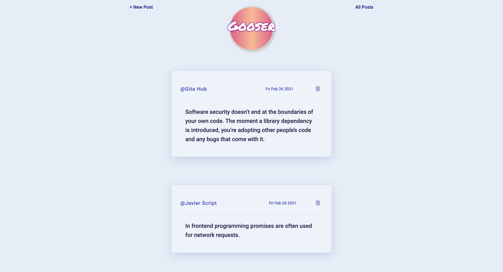

# Full-Stack MERN Blog Page
## Date: February 26, 2021
#### By: Andrew Liu, Christina Padilla, Faryal Ansari, Jonte' Fears

***

####  [Gooser (The Blog App)](https://github.com/hipstina/gooser)

***

### Developers

* ####  [Christina GitHub](https://github.com/hipstina/gooser)

* ####  [Andrew GitHub](https://github.com/andrewliu1988)

* ####  [Faryal GitHub](https://github.com/f-ansari)

* ####  [Jonte GitHub](https://github.com/JYoung554)

## Description
This is a full-stack MERN application in the form of a Blog App that will allow users to create and view posts. 

### Technologies Used
* React
* CSS
* MongoDB / Mongoose
* Express / Node

***

## Getting Started

#### To get started, [click here](https://trello.com/b/VMHiYScS/blog-project) and visit our trello board to follow the development of this game.

***

### ***Screenshots***

This was the original plan.

***

## Future Updates
- [x] ~~Create delete button ~~
- [x] ~~Create logo ~~
- [x] ~~Input validation ~~
- [ ] Create Landing page
- [ ] Create update post feature
- [ ] Mobile-friendly
- [ ] Upload Profile Picture

## Credits

[GlassMorphism](https://glassmorphism.com/)

[Font Awesome](https://fontawesome.com/v4.7.0/icons/)

[Google Fonts](https://fonts.google.com/)
